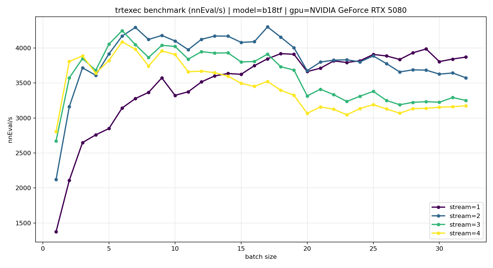
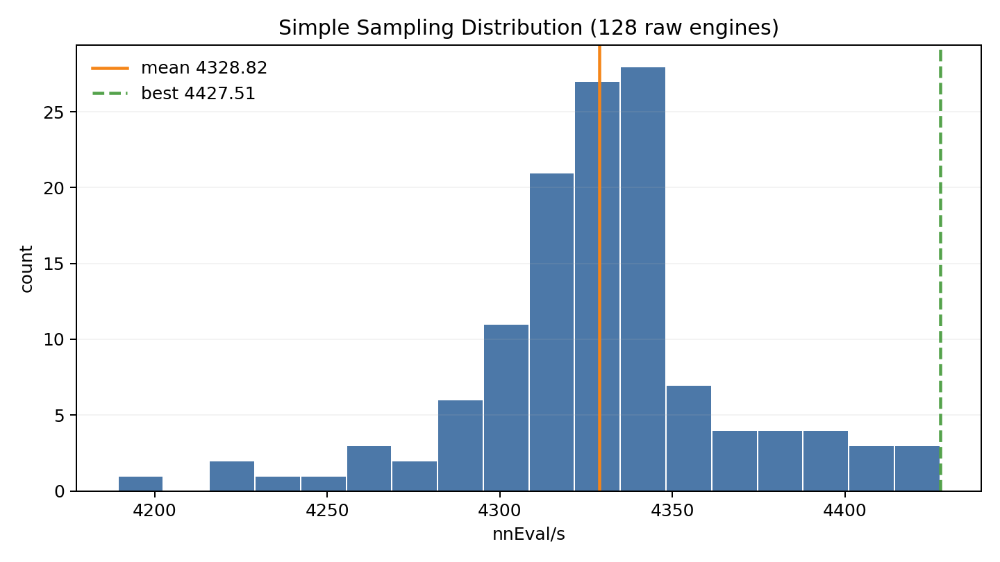

# Optimization History

## 1. Baseline

### 1.1 Test Environment
- GPU: NVIDIA GeForce RTX 5080
- TensorRT: 10.15
- Locked clocks: GPU/MEM = `2550 / 14801`
- Notes: A relatively conservative clock lock was used to avoid power or thermal limits causing frequency drift and reducing measurement accuracy.

### 1.2 Test Method
1. Run `benchmark.sh` first to get the officially recommended thread count.
2. Then run `run.sh --benchmark` with fixed parameters for standalone measurement.

### 1.3 Officially Recommended Thread Count
```text
2026-03-05 21:50:13+0800: TensorRT backend thread 0: Model version 15 useFP16 = true
numSearchThreads = 32: 10 / 10 positions, visits/s = 3209.53 nnEvals/s = 2885.87 nnBatches/s = 188.00 avgBatchSize = 15.35 (2.6 secs) (EloDiff +316) (recommended)
```
Conclusion: the official benchmark recommends `numSearchThreads = 32`.

### 1.4 `run.sh --benchmark` Measurement
```text
2026-03-05 21:53:58+0800: TensorRT backend thread 0: Model version 15 useFP16 = true
numSearchThreads = 32: 10 / 10 positions, visits/s = 4504.67 nnEvals/s = 2957.98 nnBatches/s = 185.61 avgBatchSize = 15.94 (22.3 secs) (EloDiff baseline)
```

### 1.5 Baseline Summary
- Recommended thread count: `numSearchThreads = 32`
- Baseline metrics from `run.sh --benchmark`:
  - `visits/s = 4504.67`
  - `nnEvals/s = 2957.98`
  - `nnBatches/s = 185.61`
  - `avgBatchSize = 15.94`

## 2. Parameter Tuning

### 2.1 Test Scope
- Build a plan cache for every `batch=1..32`.
- Use `trtexec` to measure throughput under different `cudaStream` settings.
- Output from `python python/benchmark.py`:
  - `benchmark/trtexec_benchmark_b18tf.onnx_gpu-NVIDIA_GeForce_RTX_5080.json`
  - `benchmark/trtexec_benchmark_b18tf.onnx_gpu-NVIDIA_GeForce_RTX_5080.png`



### 2.2 Key Conclusions
- The `batchsize must be 8+4k` restriction provides no benefit, so it was removed.
- The corresponding restriction logic in `cpp/command/benchmark.cpp` was updated.
- The final choice was `batch=7, cudaStream=2`.
- Based on the measurements, higher `cudaStream` counts did not provide consistently better throughput.

### `run.sh --benchmark` Result
```text
numSearchThreads = 21: 10 / 10 positions, visits/s = 5623.56 nnEvals/s = 3780.92 nnBatches/s = 555.69 avgBatchSize = 6.80 (17.8 secs) (EloDiff baseline)
```

### 2.3 `numSearchThreads` Choice
- Selection rule: `numSearchThreads = (numNNServerThreadsPerModel + 1) * batchsize`
- With the current parameters: `numNNServerThreadsPerModel = 2`, `batchsize = 7`, so `numSearchThreads = 21`.
- Explanation:
  - Two thread groups wait for GPU inference to return, corresponding to the two CUDA streams.
  - One extra thread group keeps generating new requests.
  - The goal is to pipeline inference and request generation so the GPU stays full as much as possible.

## 3. cudaGraph Implementation and Validation

### 3.1 Why So Many Backend Changes Were Needed
- `trtUseCudaGraph` is a TensorRT-side option, but to reach the inference execution layer it has to pass through the shared `NNEvaluator -> NeuralNet::createComputeContext` interface chain.
- If this kept using the old pattern of adding one extra boolean every time, every new TensorRT option would force all backends to change their function signatures again.
- So this change first introduced the `TRTConfigs` struct and upgraded all backend signatures in one pass. Future TensorRT options now only need new `TRTConfigs` fields and TensorRT backend logic.

### 3.2 cudaGraph Implementation Details
- Switch source: `trtUseCudaGraph` from config files and the `run.sh` override config.
- Capture strategy: pre-capture `1..maxBatchSize` by `batchSize`, storing one graph and graphExec per batch.
- Storage layout: `batchGraphStates` uses a contiguous `vector` indexed by batch rather than a `map`.
- Launch concurrency protection: a global mutex is used during pre-capture to avoid CUDA/Myelin contention errors when multiple threads try to capture simultaneously.
- Inference path:
  - When `trtUseCudaGraph` is off, keep using the original `enqueueV3`.
  - When `trtUseCudaGraph` is on, launch the pre-captured graph directly with `cudaGraphLaunch` for the current batch.

### 3.3 Same Parameters as the Previous Round (`t=21, b=7, s=2`)
```text
numSearchThreads = 21: 10 / 10 positions, visits/s = 5842.03 nnEvals/s = 3772.92 nnBatches/s = 718.58 avgBatchSize = 5.25 (17.2 secs) (EloDiff baseline)
```

Observation:
- `nnEvals/s` is close to the previous round, but `avgBatchSize` dropped significantly to `5.25`.
- This indicates that with `numSearchThreads=21`, batch aggregation is insufficient and the search threads are not fully saturating the pipeline.

### 3.4 Additional Test (`numSearchThreads=28`)
With cudaGraph enabled:
```text
numSearchThreads = 28: 10 / 10 positions, visits/s = 6421.56 nnEvals/s = 4127.33 nnBatches/s = 591.46 avgBatchSize = 6.98 (15.6 secs) (EloDiff baseline)
```

With cudaGraph disabled:
```text
numSearchThreads = 28: 10 / 10 positions, visits/s = 6066.72 nnEvals/s = 3990.65 nnBatches/s = 571.78 avgBatchSize = 6.98 (16.5 secs) (EloDiff baseline)
```

Conclusion:
- Raising `numSearchThreads` to `28` significantly improves throughput.
- Under the same `t=28,b=7,s=2`, enabling cudaGraph gives higher `nnEvals/s` than disabling it.

## 4. Explicit CUDA Copy Streams and Pinned Memory

### 4.1 What Was Implemented
- The input and output host buffers in `InputBuffers` were changed to pinned host memory.
- All H2D and D2H copies are explicitly bound to `cudaStreamPerThread`, avoiding interference from the default stream.
- D2H copies were changed to async copies, followed by a single `cudaStreamSynchronize` before CPU-side postprocessing.

### 4.2 Comparison Against Section 3 With the Same Parameters (`t=21, b=7, s=2, cudaGraph=on`)
Result from Section 3:
```text
numSearchThreads = 21: 10 / 10 positions, visits/s = 5842.03 nnEvals/s = 3772.92 nnBatches/s = 718.58 avgBatchSize = 5.25 (17.2 secs) (EloDiff baseline)
```

After adding explicit copy streams and pinned memory:
```text
numSearchThreads = 21: 10 / 10 positions, visits/s = 6277.29 nnEvals/s = 4142.30 nnBatches/s = 634.88 avgBatchSize = 6.52 (16.0 secs) (EloDiff baseline)
```

Conclusion:
- Throughput improves further while keeping `cudaGraph=on`.
- `visits/s`: `5842.03 -> 6277.29`
- `nnEvals/s`: `3772.92 -> 4142.30`

### 4.3 Additional Test (`t=28, b=7, s=2, cudaGraph=on`)
```text
numSearchThreads = 28: 10 / 10 positions, visits/s = 6550.22 nnEvals/s = 4209.86 nnBatches/s = 603.22 avgBatchSize = 6.98 (15.3 secs) (EloDiff baseline)
```

Conclusion:
- `copy stream + pinned memory` further lifts throughput on top of the cudaGraph work from Section 3.
- The current best point is `t=28,b=7,s=2,trtUseCudaGraph=true`.

## 5. `globalPerfProfile`

### 5.1 Why Profiling Was Needed
- By the end of Section 4, the obvious high-yield optimizations had already been done: parameter tuning, `cudaGraph`, explicit CUDA stream copies, and pinned memory.
- Further optimization could no longer rely on intuition alone. It was necessary to measure whether time was being spent in search threads, waiting queues, inference threads, or the GPU itself.
- Therefore `globalPerfProfile` was added to provide quantitative guidance for the next round of scheduling work.

### 5.2 Changes
- Added a global config option `globalPerfProfile`, disabled by default.
- `run.sh --benchmark` enables this option by default.
- Output is printed at the end of benchmark, after `GPU ... finishing`, so it does not interleave with the normal benchmark output.
- All statistics are corrected on a per-sample basis: each benchmark sample trims `100ms` from both the start and end to avoid treating startup/shutdown effects as steady-state behavior.
- The new metrics include:
  - `search_process_ms` and `search_wait_nn_ms` for one search-thread loop
  - Queue length time share in `queue_length_time_share`
  - Inference thread stage timings: `inference_preprocess_ms`, `inference_h2d_ms`, `inference_wait_gpu_ms`, `inference_d2h_ms`, `inference_postprocess_ms`
  - Decile distribution of launch intervals on the same GPU: `inference_launch_interval_ms`
  - Inference thread activity share: `inference_thread_time_share`
  - GPU execution time share by batch size: `gpu_batch_time_share`

### 5.3 Same Parameter Point as Section 4
To compare directly with Section 4, this section continues to use `t=21, b=7, s=2, trtUseCudaGraph=true`.

```text
numSearchThreads = 21: 10 / 10 positions, visits/s = 6341.16 nnEvals/s = 4084.83 nnBatches/s = 660.60 avgBatchSize = 6.18 (15.8 secs) (EloDiff baseline)

globalPerfProfile
  search_process_ms: P50=0.060 P95=0.142 P99=0.198
  search_wait_nn_ms: P50=3.878 P95=5.992 P99=6.231
  queue_length_time_share: q0=3.27%, q1=1.88%, q2=1.88%, q3=1.88%, q4=1.82%, q5=2.29%, q6=2.74%, q7=45.35%
    q8=4.06%, q9=9.47%, q10=10.70%, q11=8.95%, q12=5.65%, q13=0.05%
  inference_preprocess_ms: P50=0.012 P95=0.018 P99=0.020
  inference_h2d_ms: P50=0.013 P95=0.019 P99=0.022
  inference_wait_gpu_ms: P50=3.197 P95=3.297 P99=3.313
  inference_d2h_ms: P50=0.007 P95=0.013 P99=0.017
  inference_postprocess_ms: P50=0.002 P95=0.003 P99=0.003
  inference_launch_interval_ms: D10=0.025 D20=0.036 D30=0.506 D40=0.688 D50=1.650 D60=2.385 D70=2.610 D80=2.723 D90=2.833
  inference_thread_time_share: active0=0.00%, active1=0.01%, active2=99.99%
  gpu_batch_time_share: b1=0.05%, b2=3.63%, b3=5.42%, b4=6.13%, b5=5.28%, b6=2.11%, b7=77.37%
```

### 5.4 Conclusion
- Since all statistics trim `100ms` at both ends of every sample, these results can be treated as steady-state observations.
- Search-thread overhead itself is very small. Most time is still spent waiting for inference to return.
- `inference_thread_time_share` is almost entirely `active2=99.99%`, showing that both inference threads are effectively busy all the time in steady state, without long idle gaps.
- But `active1` is still nearly zero, which means the issue is not that the GPU lacks work. The real issue is that the two inference streams stay almost perfectly in phase rather than forming a healthy staggered overlap.
- In `queue_length_time_share`, `q7` and above still dominate, and `q9/q10/q11/q12` remain noticeable, indicating bursty request production and consumption rather than a smooth pipeline.
- `b7` is only about `77%`, while a meaningful portion of time still falls in non-full batches from `b2` to `b6`. So even after trimming startup and shutdown, scheduling still does not keep the GPU at full batch for long enough.

## 6. Full-Batch Scheduling

### 6.1 Changes
- Adjusted inference scheduling so that, unless the corresponding GPU is idle, only `batchSize = maxBatchSize` inference launches are allowed.
- When the GPU is idle, non-full batches are still allowed so the pipeline does not stall completely.
- The goal is not to change the search logic, but to reduce the share of GPU time spent on non-full batches.

### 6.2 Same Parameter Point as Section 5
Continue using `t=21, b=7, s=2, trtUseCudaGraph=true`.

```text
numSearchThreads = 21: 10 / 10 positions, visits/s = 6405.91 nnEvals/s = 4200.39 nnBatches/s = 601.30 avgBatchSize = 6.99 (15.6 secs) (EloDiff baseline)

globalPerfProfile
  search_process_ms: P50=0.055 P95=0.128 P99=0.175
  search_wait_nn_ms: P50=3.981 P95=5.911 P99=6.104
  queue_length_time_share: q0=4.81%, q1=2.12%, q2=1.88%, q3=1.91%, q4=2.03%, q5=3.03%, q6=4.37%, q7=79.84%
    q8=0.00%, q9=0.00%
  inference_preprocess_ms: P50=0.012 P95=0.018 P99=0.020
  inference_h2d_ms: P50=0.013 P95=0.014 P99=0.017
  inference_wait_gpu_ms: P50=3.277 P95=3.310 P99=3.322
  inference_d2h_ms: P50=0.007 P95=0.013 P99=0.013
  inference_postprocess_ms: P50=0.002 P95=0.003 P99=0.003
  inference_launch_interval_ms: D10=0.683 D20=0.858 D30=1.033 D40=1.205 D50=1.714 D60=2.121 D70=2.294 D80=2.474 D90=2.643
  inference_thread_time_share: active1=0.04%, active2=99.96%
  gpu_batch_time_share: b7=100.00%
```

### 6.3 Conclusion
- `avgBatchSize` improved from `6.18` in Section 5 to `6.99`, which is very close to the theoretical limit of `7.00`.
- `gpu_batch_time_share` reached `b7=100.00%`, meaning that in steady state the GPU is essentially no longer running non-full-batch inference.
- `nnEvals/s` improved from `4084.83` to `4200.39`, so throughput increased again.
- `queue_length_time_share` has mostly converged to `q7`, meaning the request queue no longer swings through many underfilled states and instead stays much closer to a full batch.
- `inference_thread_time_share` is still almost entirely `active2`, showing that this optimization did not introduce new steady-state idle time. Its main effect is higher batch utilization.

## 7. CUDA Synchronization Mode Switch

### 7.1 Changes
- Added a new config option `trtCudaSyncMode` with `spin|blocking|yield|auto`.
- The current default is `blocking`.
- This option controls how the host thread behaves when waiting on CUDA synchronization points such as `cudaStreamSynchronize`.
- In container environments, the process may see many logical cores without actually owning the corresponding CPU quota, so relying on the heuristics in `auto` is not safe.

### 7.2 Same Parameter Point as Section 6
Continue using `t=21, b=7, s=2, trtUseCudaGraph=true`, and compare `spin` vs `blocking`.

`spin`
```text
numSearchThreads = 21: 10 / 10 positions, visits/s = 6366.76 nnEvals/s = 4199.31 nnBatches/s = 601.23 avgBatchSize = 6.98 (15.7 secs) (EloDiff baseline)
TIME user=44.91 sys=0.71 cpu=239% elapsed=19.08
```

`blocking`
```text
numSearchThreads = 21: 10 / 10 positions, visits/s = 6301.60 nnEvals/s = 4204.38 nnBatches/s = 601.87 avgBatchSize = 6.99 (15.9 secs) (EloDiff baseline)
TIME user=16.64 sys=0.83 cpu=89% elapsed=19.57
```

### 7.3 Conclusion
- Compared with `spin`, `blocking` reduces total CPU time from `45.62s` to `17.47s`, a drop of about `61.7%`.
- Throughput changes very little:
  - `visits/s`: `6366.76 -> 6301.60`, about `-1.0%`
  - `nnEvals/s`: `4199.31 -> 4204.38`, essentially unchanged and within noise
- For CPU-constrained environments, `blocking` is clearly friendlier.
- For environments that only care about the lowest wait latency and have abundant CPU resources, `spin` still matches CUDA's traditional default usage better.

## 8. TRT Configuration Knobs

### 8.1 Full List
- `trtBuilderOptimizationLevel`
  - Internal TensorRT builder parameter.
  - Controls how much overall search effort the builder spends looking for better tactics.
  - Default `-1` means keep TensorRT's default behavior and do not call the setter.

- `trtMaxAuxStreams`
  - Internal TensorRT builder parameter.
  - Controls the maximum number of auxiliary streams allowed during engine build.
  - Default `-1` means keep TensorRT's default behavior and do not call the setter.

- `trtAvgTimingIterations`
  - Internal TensorRT builder parameter.
  - Controls how many timing iterations the builder averages during tactic profiling.
  - Default `-1` means keep TensorRT's default behavior and do not call the setter.

- `trtTilingOptimizationLevel`
  - Internal TensorRT builder parameter.
  - Controls whether TensorRT attempts on-chip cache tiling optimization and how aggressively it searches.
  - Allowed values: `none|fast|moderate|full`

- `trtDeviceToUse`
  - Selects the default device for single-GPU runs.

- `trtDeviceToUseThreadN`
  - Selects device mapping per inference thread for multi-threaded inference or multi-GPU runs.

### 8.2 Notes
- This section only lists TRT configuration knobs whose behavior depends heavily on the exact GPU, driver, TensorRT version, and container or host environment.
- Therefore they are exposed as open configuration knobs, but this document does not give fixed benchmark conclusions for them.
- To compare them meaningfully, they should be tested in isolation while keeping `batchSize`, `cudaStream`, `cudaGraph`, clocks, and temperature conditions fixed.

## 9. Simple Sampling

### 9.1 benchmark.py workflow changes
- `benchmark.py` now uses a single main workflow instead of separating normal benchmarking from a dedicated simple-sampling mode.
- Added `--build-count`, meaning “how many independent plans to build for the same `batchSize`”.
- Added `--devices`, so independent builds can be spread across multiple identical GPUs.
- Added `--home-data-dir-base`, so every build gets its own isolated `homeDataDir/trtcache` and samples no longer overwrite each other.

The point of this refactor was not to change TRT settings. It was to turn “build the same model multiple times and keep the best engine” into a stable, resumable, multi-GPU-friendly workflow.

To run one fixed-configuration sampling pass across multiple GPUs, keep `batchSize` and `stream` pinned and combine `--devices`, `--build-count`, and `--home-data-dir-base`. The example below spreads `64` raw samples of `batch=7, stream=2` across two identical GPUs:

```bash
python python/benchmark.py \
  --devices 3,4 \
  --build-count 64 \
  --max-batch 7 \
  --batch-min 7 \
  --batch-max 7 \
  --stream-min 2 \
  --stream-max 2 \
  --home-data-dir-base benchmark/home_data_runs
```

`benchmark.py` distributes the independent builds across the selected GPUs and gives each build its own isolated `homeDataDir/trtcache`.

### 9.2 Distribution of 128 raw samples
- Fixed parameters: `batch=7, stream=2, cudaGraph=on`
- Total sample count: `128` independently built raw engines
- Summary:
  - `mean = 4328.82 nnEval/s`
  - `median = 4330.00 nnEval/s`
  - `std = 38.04`
  - `min = 4189.35`
  - `max = 4427.51`
  - `P05/P95 = 4261.58 / 4396.41`



Conclusions:
- Even under the same configuration, TensorRT builder produces a real performance distribution across independently built engines rather than a single stable point.
- The best sample is about `98.69 nnEval/s` above the overall mean, or roughly `+2.28%`.
- This is enough to justify simple sampling by itself. In many cases, repeatedly rebuilding and selecting the best engine is already useful without introducing a more complicated search algorithm.

### 9.3 Additional note
- A separate comparison also showed that building under locked GPU clocks and then running later under unlocked clocks can hurt performance.
- Therefore later simple-sampling runs no longer rely on locked-clock builds. Engines are now built directly under the intended runtime conditions.

## 10. TRT I/O Overlapping Scheduler

### 10.1 Changes
- The core target in this section is stable I/O overlapping, so `H2D copy`, `GPU inference`, and `D2H copy` can progress in an interleaved steady-state pipeline.
- The TensorRT path in `NNEvaluator` now includes an execution-model-level breaking change.
- The old model used multiple server threads, each pulling requests and running a full inference chain independently.
- The new TensorRT model is scheduler-driven through `serveTrtScheduler`; `spawnServerThreads()` starts a single scheduler thread for this path.
- The scheduler centrally manages GPU slots, batch lifecycles, and request dispatch, so the TensorRT execution entrypoint shifts away from per-thread `serve()`.
- To support this model, the TensorRT backend and `NeuralNet::getOutput()` both move to staged async submission with explicit `h2dStream`, `inferStream`, and `d2hStream`.
- This section keeps focus on execution model and scheduling semantics. Internal details such as shared-buffer internals and state-machine transitions are intentionally kept brief.

### 10.2 Profiling semantics changed
- `globalPerfProfile` now follows the scheduler-plus-three-stream model.
- Older fields such as `queue_length_time_share`, `inference_thread_time_share`, `gpu_batch_time_share`, and `inference_*_ms` are no longer the primary observation surface for this section.
- The primary fields are now:
  - `scheduler_busy_time_share`
  - `scheduler_idle_time_share`
  - `h2d_stream_occupancy`
  - `infer_stream_occupancy`
  - `d2h_stream_occupancy`
  - `h2d_submit_wait_ms`
  - `infer_submit_wait_ms`
  - `d2h_submit_wait_ms`
- Future benchmark analysis should be based on these fields when judging overlap formation. Section 5/6 legacy fields do not map directly.

### 10.3 Standard-flow comparison against previous commit
- Test date: `2026-03-16`
- Test flow: for both versions, run `./build.sh`, then run `./run.sh --benchmark` `3` times.
- Previous commit `b11256e4` `nnEvals/s`:
  - `4318.43`
  - `4300.27`
  - `4289.34`
  - mean `4302.68`, stddev `12.00`
- Current commit `41fa5b5d` `nnEvals/s`:
  - `4396.67`
  - `4356.49`
  - `4369.00`
  - mean `4374.05`, stddev `16.79`
- Mean delta: `+71.37 nnEvals/s`, about `+1.66%`.
- Under the current test environment and default benchmark parameters, the I/O-overlapping scheduler path shows a stable throughput gain.
